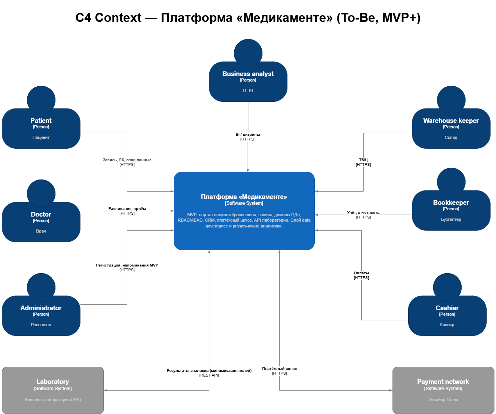

# Task 2 — Проектирование решения (Privacy by Design)

## Итоговые артефакты

- Диаграмма **контекста** в модели **C4**.
- Диаграмма **контейнеров (C2)** в модели **C4**.
- **Проект архитектуры MVP** (целевой контур на уровне контекста).

## Состав каталога

| Файл | Содержание |
|------|------------|
| [c4-context-mvp.drawio](c4-context-mvp.drawio) | **C4 Context:** платформа «Медикаменте» (To-Be), персоны, внешние Laboratory и Payment network, связи HTTPS / REST |
| [c4-container-mvp.drawio](c4-container-mvp.drawio) | **C4 Container (C2):** контейнеры контура классификации/политик, trusted ingestion, Data Lake/Lakehouse, конкретные технологии |
| [c4-context-and-mvp.md](c4-context-and-mvp.md) | Описание системы, границы MVP, акторы, потоки, связь с Task 3 и **Task 6**; отдельный раздел с пояснением, почему C2 с конкретными технологиями вынесен в Task 6 |
Согласование с движком классификации: [Task6/c2-classification-engine.md](../Task6/c2-classification-engine.md) и [c4-container-mvp.drawio](c4-container-mvp.drawio).

## Рекомендации

- Новые блоки под Privacy by Design и аналитический слой согласовать с Task 6: [Task6/c2-classification-engine.md](../Task6/c2-classification-engine.md).
